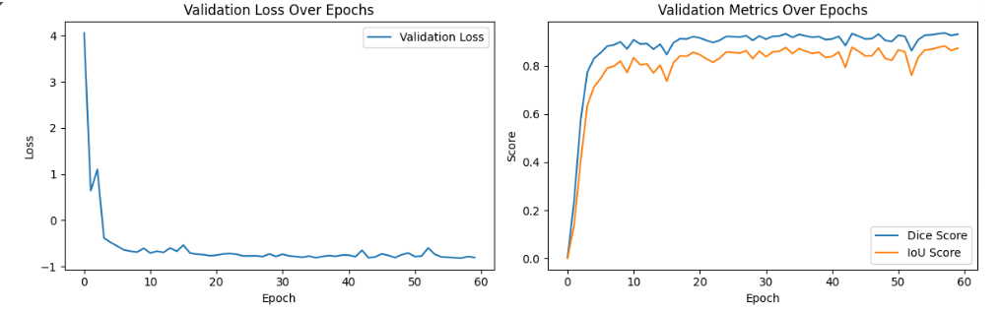
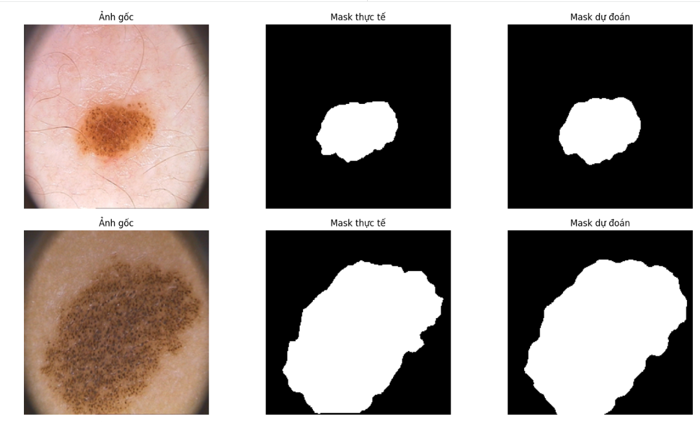
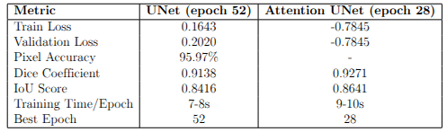

# Phân vùng da ung thư sử dụng UNet và Attention UNet

Dự án cuối kỳ môn Chuyên đề 2 - Nhóm 22

## Giới thiệu

Dự án này xây dựng hệ thống phân vùng tự động các vùng da bị tổn thương do ung thư sử dụng mô hình học sâu UNet và Attention UNet. Hệ thống có thể hỗ trợ các bác sĩ da liễu trong việc phát hiện sớm và phân tích các tổn thương da.

## Thành viên nhóm

- **Thành viên 1:** Tô Ngọc Hoan - 106210213
- **Thành viên 2:** Nguyễn Ngọc Hưng - 106210216

## Tính năng chính

- Phân vùng tự động vùng da bị tổn thương từ ảnh
- Hỗ trợ 2 kiến trúc: UNet cơ bản và Attention UNet
- Đánh giá hiệu suất với nhiều metrics: Dice, IoU, Pixel Accuracy
- Trực quan hóa kết quả dự đoán

## Kết quả

### UNet + DiceBCE Loss
- **Dice Coefficient:** 0.9138
- **IoU Score:** 0.8416
- **Pixel Accuracy:** 95.97%

### Attention UNet + DiceBCE Loss
- **Dice Coefficient:** 0.9271 (↑1.33%)
- **IoU Score:** 0.8641 (↑2.25%)
- **Pixel Accuracy:** 96.5%+


## Yêu cầu hệ thống

### Phần mềm
- Python 3.8+
- PyTorch 2.0+
- CUDA 11.8+ (khuyến nghị để huấn luyện nhanh)

### Thư viện Python
```
torch>=2.0.0
torchvision>=0.15.0
numpy>=1.24.0
matplotlib>=3.7.0
Pillow>=9.5.0
scikit-learn>=1.2.0
tqdm>=4.65.0
torchsummary>=1.5.1
```

## Cấu hình huấn luyện

### UNet cơ bản
- **Batch size:** 8
- **Learning rate:** 0.0001
- **Optimizer:** Adam
- **Loss function:** DiceBCE (BCE + Dice Loss)
- **Epochs:** 100 (Early stopping tại epoch 52)
- **Scheduler:** ReduceLROnPlateau (patience=5)

### Attention UNet
- **Batch size:** 16
- **Learning rate:** 0.001
- **Optimizer:** Adam
- **Loss function:** DiceBCE (BCE + Dice Loss)
- **Epochs:** 60 (Best tại epoch 28)

## Tập dữ liệu

- **Tổng số mẫu:** 200 cặp ảnh-mask
- **Kích thước ảnh:** 224×224 pixels
- **Định dạng:** BMP
- **Phân chia:**
  - Training: 80% (160 mẫu)
  - Validation: 20% (40 mẫu)

## Metrics đánh giá

### Dice Coefficient
Đo độ tương đồng giữa mask dự đoán và mask thực tế. Giá trị từ 0 đến 1, càng cao càng tốt.

### IoU (Intersection over Union)
Đo độ chồng lấp giữa vùng dự đoán và vùng thực tế. IoU > 0.7 được coi là tốt.

### Pixel Accuracy
Tỷ lệ pixel được phân loại đúng trên tổng số pixel.

## Kết quả trực quan

### Biểu đồ huấn luyện Unet


### Biểu đồ huấn luyện Attention Unet


### Kết quả dự đoán


### So sánh kết quả huấn luyện giữa hai mô hình


## Hạn chế và hướng phát triển

### Hạn chế hiện tại
- Tập dữ liệu còn nhỏ (200 mẫu)
- Chưa áp dụng data augmentation mạnh
- Chưa thử nghiệm với pre-trained backbone

### Hướng phát triển
- Mở rộng tập dữ liệu
- Áp dụng data augmentation: rotation, flipping, color jittering
- Thử nghiệm UNet++ và các kiến trúc tiên tiến khác
- Sử dụng transfer learning với ResNet, EfficientNet
- Triển khai ứng dụng web/mobile

## Liên hệ

Nếu có thắc mắc hoặc góp ý, vui lòng liên hệ:
- Email: nguyenngochung110@gmail.com

## License

Dự án này được phát triển cho mục đích học tập và nghiên cứu.

---

**Lưu ý:** Hệ thống này chỉ mang tính chất hỗ trợ và không thay thế cho chẩn đoán y khoa chuyên nghiệp.